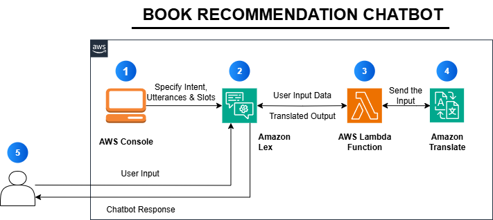

# Book-Recommendation-ChatBot

1.Navigate to Amazon Lex on AWS console and create a chatbot. 

2.Provide the chatbot with user intent, utterances and slots. 

3.Pass the user data input available from the selected slots and get the translation from Amazon Translate. 

4.Provides the translation according to the given language. 

5.User gives input and the chatbot provides the output of the translation given by the Lambda function.
